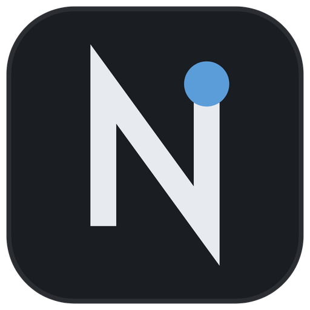

<div align="center">



# Nimbus Client

**Быстрый, тихий и честный лаунчер Minecraft для Windows.**

Rust + Tauri 2 в бэкенде · Svelte 5 + TypeScript + Vite во фронтенде · CSS без фреймворков


</div>

---

## Что это

Nimbus Client — десктопный лаунчер Minecraft: ставит любые версии игры, любые
модлоадеры, качает и обновляет моды с Modrinth, изолирует сборки друг от друга
и умеет откатывать неудачные эксперименты одним кликом.

Весь UI написан на вебе, но приложение — не Electron: окно рендерит системный
WebView2, а вся тяжёлая работа (скачивание, проверка хешей, распаковка,
запуск JVM) выполняется в нативном Rust-бэкенде. Отсюда маленький установщик,
быстрый старт и низкое потребление памяти в простое.

**Ключевые принципы проекта**

- Никаких фиктивных данных в интерфейсе: если функция недоступна, кнопка
  выключена и рядом написана причина.
- Каждый скачанный файл проверяется по хешу — битые библиотеки не доезжают
  до запуска.
- Токены аккаунтов шифруются средствами Windows, а не лежат текстом.
- Ни одна фоновая мелочь (Discord, обновления, звуки) не имеет права уронить
  или задержать запуск игры.

---

## Возможности

### Сборки (инстансы)

- Создание, переименование, дублирование и удаление сборок.
- Полная изоляция: у каждой сборки свой игровой каталог, свои моды, миры,
  конфиги и скриншоты.
- Подсчёт занимаемого места по каждой сборке.
- Индивидуальные настройки: объём памяти, аргументы JVM, флаги Aikar,
  свой путь к Java, размер игрового окна и полноэкранный режим.
- Проверка целостности сборки (`verify`) с дозагрузкой недостающих файлов.

### Версии и модлоадеры

- Установка любых версий из официального манифеста Mojang (release, snapshot,
  старые альфы и беты).
- Поддержка четырёх загрузчиков: **Fabric**, **Quilt**, **Forge**, **NeoForge**.
- Forge и NeoForge ставятся через реальные installer-jar и Maven-метаданные,
  Fabric и Quilt — через их Meta API.
- Общее контентно-адресуемое хранилище библиотек и ассетов: десять сборок на
  одной версии не занимают место десять раз.
- Корректная распаковка natives, разбор правил `rules`/`os.version`,
  фильтрация библиотек по платформе.
- Прогресс, скорость и возможность отменить установку в любой момент.

### Java

- Автоопределение установленных JRE/JDK: `JAVA_HOME`, реестр Windows,
  стандартные каталоги Adoptium, Eclipse, Oracle, Zulu.
- Мажорная версия читается из файла `release`, а при его отсутствии —
  из вывода `java -version`, без догадок по имени папки.
- Если подходящей Java нет, она автоматически скачивается через **Adoptium API v3**
  и распаковывается в `runtimes/<major>/`.
- Ручной выбор `javaw.exe` в настройках, если нужен конкретный рантайм.

### Аккаунты

- Полноценный вход через **Microsoft OAuth** (Xbox Live → XSTS → Minecraft Services).
- Несколько аккаунтов одновременно с быстрым переключением.
- Токены шифруются через **Windows DPAPI** (`CryptProtectData`) — расшифровать их
  может только тот же пользователь Windows на той же машине.
- Офлайн-режим с ником и корректным офлайн-UUID (`MD5("OfflinePlayer:<name>")`
  с проставленными битами версии и варианта RFC-4122).
- Azure Client ID задаётся в настройках; инструкция — в [`docs/AZURE_SETUP.md`](docs/AZURE_SETUP.md).

### Моды и Modrinth

- Список модов сборки с включением/выключением каждого jar без удаления.
- Добавление модов файлом с диска и удаление из интерфейса.
- Встроенный поиск по **Modrinth**: карточки проектов, описание, версии,
  установка в один клик.
- **Проверка обновлений** по SHA-1 каждого jar: лаунчер не хранит метаданные,
  а спрашивает Modrinth, что это за файл и есть ли новее.
- Обновление одного мода или всех сразу.
- **Разрешение зависимостей**: установка мода вместе с обязательными
  библиотеками.

### Модпаки

- Импорт `.mrpack` (формат Modrinth) с проверкой хешей и защитой от
  вредоносных путей внутри архива.
- Поиск и установка модпаков прямо из Modrinth.
- Проверка обновления модпака и обновление на новую версию.
- **Экспорт своей сборки в `.mrpack`**: узнаваемые моды уходят ссылками, всё
  остальное (конфиги, ресурспаки, шейдеры, самосборные jar) — в `overrides/`.
- Импорт сборок из **Prism Launcher / MultiMC**: сканирование каталога и
  перенос инстансов.
- Резервное копирование: экспорт и импорт сборки целиком.

### Точки восстановления

- Локальные снапшоты папки `mods` перед рискованными операциями.
- Хранятся в `<instance>/restore-points/<YYYYMMDD-HHMMSS>/`.
- Откат в один клик, автоматическая чистка: хранятся последние 10 снапшотов.

### Скриншоты, логи и диагностика

- Галерея скриншотов сборки: просмотр, копирование, удаление. Картинки
  отдаются через asset-протокол Tauri, а не через IPC.
- Живая консоль игры с выводом процесса в реальном времени.
- Просмотр лог-файлов и быстрые кнопки «открыть папку»: игра, моды,
  скриншоты, краш-репорты, логи.
- Список краш-репортов, чтение и **автоматический разбор** с подсказкой,
  какой мод или какая причина вероятнее всего сломала запуск.
- Очистка общего хранилища от мусора.

### Интерфейс

- Собственный безрамочный titlebar, вертикальный рейл сборок, контекстный хедер.
- **Командная палитра** для быстрых действий с клавиатуры.
- Тосты, скелетоны вместо спиннеров, честные пустые состояния и онбординг.
- Темы: тёмная, светлая, системная.
- Дизайн-система в токенах: один акцент `#5b9dd9`, сетка 4 px, анимации
  120/160/200 ms, полное уважение к `prefers-reduced-motion`.
- **Синтезированный звук интерфейса**: ни одного аудиофайла в поставке, все
  эффекты собираются на лету через Web Audio API, громкость и выключатель — в настройках.
- **Два языка**: интерфейс написан на русском, английский собирается
  DOM-слоем автоперевода по словарю, с сохранением оригинала для обратного
  переключения.

### Системная интеграция

- **Discord Rich Presence**: статус «в лаунчере» при запуске приложения и
  «играет в <сборку>» во время игры. Работает без аккаунта и без секретов,
  отключается в настройках.
- **Single instance**: повторный запуск ярлыка не плодит процессы, а
  разворачивает уже открытое окно (иначе два процесса дрались бы за `config.json`).
- **Автообновление**: подписанные сборки, проверка через Tauri Updater,
  тихая установка.
- Проверка наличия WebView2 Runtime при старте с понятным диалогом вместо
  белого окна.
- Глобальный panic-hook с нативным диалогом об ошибке.

---

## Установка

Скачайте установщик `Nimbus.Client_<версия>_x64-setup.exe` из
[релизов](https://github.com/coddyxdev/Nimbus-Launcher/releases/latest).

- Установка идёт в пользовательский профиль, права администратора не нужны.
- Установщик доступен на русском и английском.
- Если WebView2 Runtime отсутствует (актуально для части сборок Windows 10),
  он будет дозагружен автоматически.

Последующие обновления лаунчер ставит сам.

---

## Сборка из исходников

### Требования

| Компонент | Версия |
| --- | --- |
| Windows | 10/11 x64 |
| Node.js | 20+ |
| Rust | stable MSVC, 1.77+ |
| Visual Studio Build Tools | workload «Desktop development with C++» + Windows SDK |
| WebView2 | предустановлен в Windows 11 |

```bat
winget install Rustlang.Rustup
rustup default stable-x86_64-pc-windows-msvc
```

### Запуск и сборка

```bash
npm install

# режим разработки: HMR фронтенда + пересборка Rust по изменениям
npm run tauri dev

# релизная сборка: svelte-check + vite build + NSIS installer
npm run build
```

Результаты:

- `src-tauri/target/release/nimbus-client.exe` — портативный бинарник;
- `src-tauri/target/release/bundle/nsis/*.exe` — установщик.

> [!WARNING]
> Не собирайте релиз через `cargo build --release`. Эта команда компилирует
> только Rust и не запускает `vite build`: фронтенд не попадает в бинарник,
> WebView откатывается на `devUrl`, и вместо интерфейса вы увидите
> `ERR_CONNECTION_REFUSED`. В `tauri.conf.json` задан `"frontendDist": "../dist"`,
> и `build.outDir` из `vite.config.ts` обязан с ним совпадать.

### Проверки

```bash
npm run check          # svelte-check + vite build + cargo check
npm run test:rust      # юнит-тесты Rust

cargo fmt --manifest-path src-tauri/Cargo.toml --check
cargo clippy --manifest-path src-tauri/Cargo.toml --all-targets -- -D warnings

# реальный дым-тест: скачивает версию и запускает её на N секунд
npm run smoke -- 1.21.1 25
```

---

## Где лежат данные

Всё пользовательское хранится в `%APPDATA%\NimbusClient`:

```
%APPDATA%\NimbusClient\
├─ config.json      настройки лаунчера (атомарная запись, версионирование, миграции)
├─ account.json     аккаунты; токены зашифрованы DPAPI
├─ instances\       изолированные сборки: моды, миры, конфиги, скриншоты
├─ shared\          общие библиотеки и ассеты, адресуемые по содержимому
├─ runtimes\        автоматически скачанные JRE, по мажорным версиям
└─ logs\            логи лаунчера и игры
```

Битый `config.json` не блокирует запуск: он переименовывается в
`config.corrupt.json`, а на его место встаёт свежий дефолтный.

---

## Структура репозитория

```
Nimbus-Launcher/
├─ index.html
├─ package.json               скрипты dev / build / check / smoke
├─ vite.config.ts             outDir синхронизирован с frontendDist
├─ svelte.config.js
├─ tsconfig.json
├─ .github/workflows/         CI: сборка, clippy, тесты, audit, bundle
├─ docs/
│  ├─ IPC.md                  контракт всех IPC-команд
│  ├─ AZURE_SETUP.md          регистрация приложения для входа Microsoft
│  └─ RELEASE.md              публикация релиза и настройка автообновления
├─ public/logo.png
├─ src/                       фронтенд
│  ├─ main.ts
│  ├─ app.css                 базовые стили и примитивы
│  ├─ styles/tokens.css       цвет, типографика, сетка, мотион
│  ├─ components/
│  │  ├─ App.svelte           оболочка и машина состояний
│  │  ├─ Titlebar.svelte      drag-region, snap, свои кнопки окна
│  │  ├─ Rail.svelte          рейл сборок
│  │  ├─ Header.svelte        контекстный хедер
│  │  ├─ InstancePane.svelte  карточка сборки: моды, скриншоты, логи, откаты
│  │  ├─ CreateInstance.svelte    мастер создания: версия, загрузчик, модпак
│  │  ├─ SettingsPane.svelte  настройки лаунчера и аккаунтов
│  │  ├─ ModDetails.svelte    страница мода с Modrinth
│  │  ├─ CommandPalette.svelte
│  │  ├─ GameConsole.svelte   живой вывод процесса игры
│  │  ├─ Onboarding.svelte, EmptyState.svelte, Skeleton.svelte,
│  │  └─ ToastHost.svelte, Icon.svelte
│  └─ lib/
│     ├─ ipc.ts               типизированный слой invoke и нормализация ошибок
│     ├─ install.svelte.ts    состояние установки и прогресса
│     ├─ i18n.svelte.ts       переключатель языка
│     ├─ auto-i18n.svelte.ts  DOM-слой автоперевода RU → EN
│     ├─ locale-en.ts         словарь английской локали
│     ├─ markdown.ts          рендер описаний с Modrinth
│     ├─ sound.svelte.ts      синтезированные звуки интерфейса
│     ├─ updater.ts, theme.ts, toast.svelte.ts, icons.ts
└─ src-tauri/                 бэкенд
   ├─ Cargo.toml              opt-level=2, LTO, strip; panic остаётся unwind
   ├─ tauri.conf.json         окно, CSP, NSIS, updater
   ├─ capabilities/default.json   белый список разрешений
   ├─ examples/smoke.rs       дым-тест реального запуска игры
   └─ src/
      ├─ lib.rs               сборка приложения и регистрация всех команд
      ├─ commands/            вся IPC-поверхность, по областям
      │  ├─ auth_cmds.rs      вход Microsoft, список и переключение аккаунтов
      │  ├─ config_cmds.rs    bootstrap, тема, ник, онбординг, настройки
      │  ├─ instances.rs      список, удаление, дублирование, размер
      │  ├─ install.rs        установка версии и загрузчика, отмена, verify
      │  ├─ launch.rs         запуск, остановка, поиск Java
      │  ├─ mods.rs           моды сборки
      │  ├─ mod_updates.rs    обновления и зависимости модов
      │  ├─ modrinth_cmds.rs  поиск и установка с Modrinth
      │  ├─ modpack.rs        импорт .mrpack и модпаки Modrinth
      │  ├─ export_pack.rs    экспорт сборки в .mrpack
      │  ├─ prism.rs          импорт из Prism / MultiMC
      │  ├─ backup.rs         экспорт и импорт сборки
      │  ├─ restore.rs        точки восстановления
      │  ├─ gallery.rs        галерея скриншотов
      │  ├─ files.rs          папки, краш-репорты и их разбор
      │  └─ logs.rs           логи игры
      ├─ version.rs           манифест версий и правила Mojang
      ├─ libraries.rs         библиотеки, classpath, фильтры платформы
      ├─ natives.rs           распаковка нативных библиотек
      ├─ assets.rs            индекс ассетов
      ├─ download.rs          загрузчик с проверкой SHA-1 / SHA-256
      ├─ loader.rs            Fabric, Quilt, Forge, NeoForge
      ├─ forge_install.rs     запуск installer-jar и постобработка
      ├─ java.rs              поиск и автозагрузка JRE (Adoptium API v3)
      ├─ launcher.rs          сборка командной строки и запуск JVM
      ├─ instance.rs          модель сборки и её файлы на диске
      ├─ account.rs           хранение аккаунтов, шифрование токенов
      ├─ auth.rs              OAuth-цепочка Microsoft → Xbox → Minecraft
      ├─ modrinth.rs          клиент Modrinth API
      ├─ presence.rs          Discord Rich Presence
      ├─ winprotect.rs        DPAPI через прямой FFI к crypt32.dll
      ├─ webview2.rs          проверка WebView2 Runtime при старте
      ├─ config.rs            атомарная запись, версии, миграции
      ├─ paths.rs             каталоги данных и защита от path traversal
      └─ error.rs             единый тип ошибки, сериализуется как { kind, message }
```

---

## Безопасность

- **Path traversal.** Любой путь, пришедший из внешних данных (имя файла в zip,
  имя ассета, запись модпака), проходит через единый `paths::safe_join`,
  который отбрасывает `..`, абсолютные пути и буквы дисков. Проверка написана
  один раз и покрыта тестами.
- **Целостность загрузок.** Каждый артефакт сверяется с ожидаемым SHA-1/SHA-256
  из манифеста; несовпадение — ошибка, а не предупреждение.
- **Токены.** Учётные данные Microsoft шифруются Windows DPAPI, тем же
  механизмом, которым Chrome и Edge защищают сохранённые пароли.
- **CSP.** Окно работает под строгой политикой: `script-src 'self'`,
  внешние скрипты и inline-JS запрещены.
- **Минимум разрешений.** `capabilities/default.json` перечисляет ровно те
  возможности Tauri, которые нужны оболочке, — ничего сверх.
- **Подпись обновлений.** Апдейтер принимает только сборки, подписанные
  приватным ключом проекта; публичный ключ вшит в конфиг.

---

## CI

`.github/workflows/ci.yml` на каждый push и pull request поднимает Windows-раннер и гоняет:

| Job | Что делает |
| --- | --- |
| `check` | `npm ci`, сборка фронтенда, `cargo fmt --check`, `clippy -D warnings`, `cargo check`, `cargo test` |
| `audit` | `cargo audit` по `Cargo.lock` и `npm audit --audit-level=high` |
| `bundle` | Полная сборка NSIS-установщика, чтобы поломанная конфигурация подписи всплыла до релиза, а не во время него |
| `smoke` | Реальное скачивание и запуск 1.20.1 и 1.21.1; только вручную (`workflow_dispatch`), потому что тянет гигабайты |

---

## Релизы

Исходники живут здесь, а собранные установщики публикуются в отдельном
публичном репозитории `coddyxdev/Nimbus-Launcher`. Так апдейтер может
скачивать `latest.json` без авторизации.

Коротко процесс такой: поднять `version` в `tauri.conf.json`, `package.json` и
`Cargo.toml`, закоммитить, поставить тег `vX.Y.Z` и запушить его —
`release.yml` соберёт подписанный установщик и создаст черновик релиза.
Полная инструкция, включая генерацию ключей и настройку секретов, —
в [`docs/RELEASE.md`](docs/RELEASE.md).

---

## Документация

- [`docs/IPC.md`](docs/IPC.md) — контракт всех команд между фронтендом и бэкендом.
- [`docs/AZURE_SETUP.md`](docs/AZURE_SETUP.md) — регистрация Azure-приложения для входа через Microsoft.
- [`docs/RELEASE.md`](docs/RELEASE.md) — публикация релизов и автообновление.

---

## Дисклеймер

Nimbus Client — независимый проект. Он не связан с Mojang Studios и Microsoft
и не поддерживается ими. Minecraft — торговая марка Mojang Studios.
Для игры в онлайн-режиме нужна купленная копия Minecraft.

## Почему Windows ругается при установке

При запуске установщика может появиться окно **«Система Windows защитила ваш ПК»**
(Microsoft Defender SmartScreen).

Это **не означает**, что в файле вирус. SmartScreen смотрит не на содержимое
программы, а на её «репутацию»: у новых программ от независимых разработчиков,
у которых ещё нет платного сертификата подписи кода, её по определению нет.

**Как установить:** нажмите «Подробнее» → «Выполнить в любом случае».

**Как убедиться, что файл настоящий:**

* Скачивайте только со страницы
  [Releases](https://github.com/coddyxdev/Nimbus-Launcher/releases) этого репозитория.
* Все релизы собираются автоматически в GitHub Actions из исходного кода этого
  репозитория — ручные сборки не публикуются.
* Каждый установщик подписан криптографически (файл `.exe.sig`), и встроенный
  автообновлятор проверяет эту подпись перед любым обновлением.
* Исходный код открыт полностью — его можно проверить и собрать самому.

Подробности о том, как собираются и подписываются релизы: [docs/CODE_SIGNING.md](docs/CODE_SIGNING.md).

## Лицензия

[MIT](LICENSE) © coddyxdev

Nimbus Client не связан с Mojang Studios или Microsoft. Minecraft — товарный знак
Mojang Studios.
